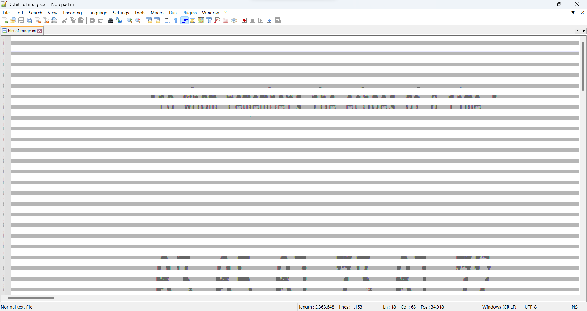
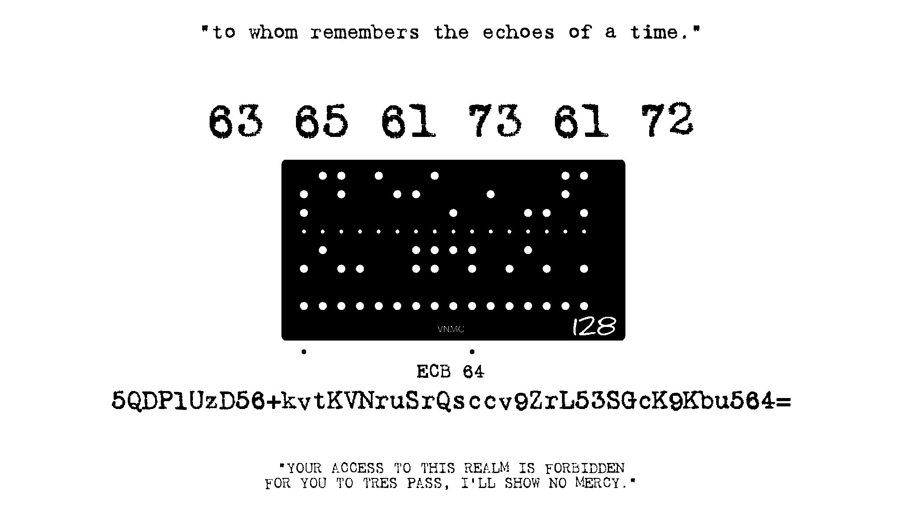
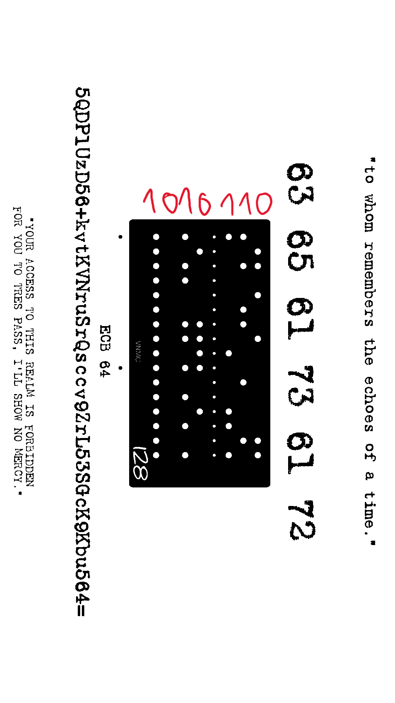
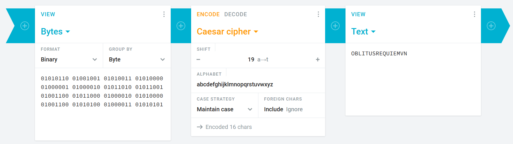

# 2023/05/07: `oblitus_litteria.docx`

## 1. The Word file

Upon opening the file `oblitus_litteria.docx`, you're greeted with a file with some opening text, then a huge block of seemingly just a string of 1s and 0s

First thing to notice is `2361344/1153`. This is a simple division, and the result of it is 2048. This will be related to the block of numbers below.

(Note: I didn't really use this clue, because the way I was thinking didn't require the use of it)

If you scroll down and have a closer look at each string of numbers, you'll notice that each of them has the exact same length (in fact, it's equal to 2048!). Together with the fact that each string only consists of 1s and 0s, led me to believe that it was some kind of bitmap/ASCII art.

So I copied all of the numbers into Notepad++, zoomed way out, and there it is!

Of course, no one wants to stare at a badly drawn image in a text editor, which is not the greatest image viewer, so I wrote some Python to turn each digit into a pixel (1 = white, 0 = black), and output it into an image. The result is this:

## 2. The image

### 2.1. The 6 numbers

Right out of the gate, I immediately recognized the 6 numbers as ASCII code. Converting them out yields `Caesar`, which is a hint for the next cipher.

### 2.2. False dots

Next up, we have a series of dots on a black card. You might think that it's Braille, but that's a trap. I tried to read out each Braille character, typed them in a Braille decoder, only to get back plain gibberish. I wasted a good few hours on this, and then I have an idea: "What if it's not Braille, but just a representation of bits?"

I was correct! This is what computers in the old days had to deal with, which is called a punch card. Each white circle is a hole on the card, which represents 1, and the black part is 0. You read each bit out column by column, bottom to top, yielding 7 bits per column.

After this, it's just a matter of reading each column out, turning it into characters (remember to add a 0 at the front of each, because ASCII is originally 7 bit), then tinker around with the Caesar offset, and we found our 2nd clue!

### 2.3. Modern cryptography

The string yielded from the previous step (`OBLITUSREQUIEMVN`) is the key to decrypt the last message, which is a base64 encoded ciphertext, encrypted with AES-ECB-128, you can find decryptors for that on the Internet, so I'll leave the last step to you :)

(Note: The 64 is NOT the key size! It's the 128 written on the card. Since I already know that the last message is base64 encoded, I assume the 64 is the key size, which wasted me several more hours trying different key combinations, and even brute forcing the key, only to be given a clue that it's not 64 bit long. YAY!)

## 4. Remarks

Aside from 2 rabbit holes that I fell into (which was not great at all), this is a pretty fun challenge, and incorporated ancient and modern encryption into a nice little package (and I got a little treat out of that as well :>). I'd have to thank the author of this for making it computer related though, or else I would have given up on it already :D
