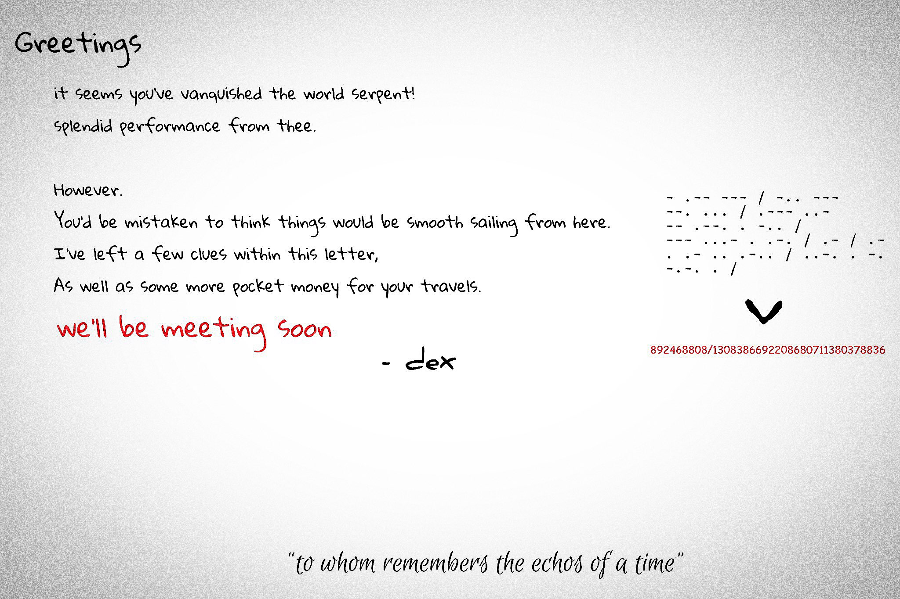
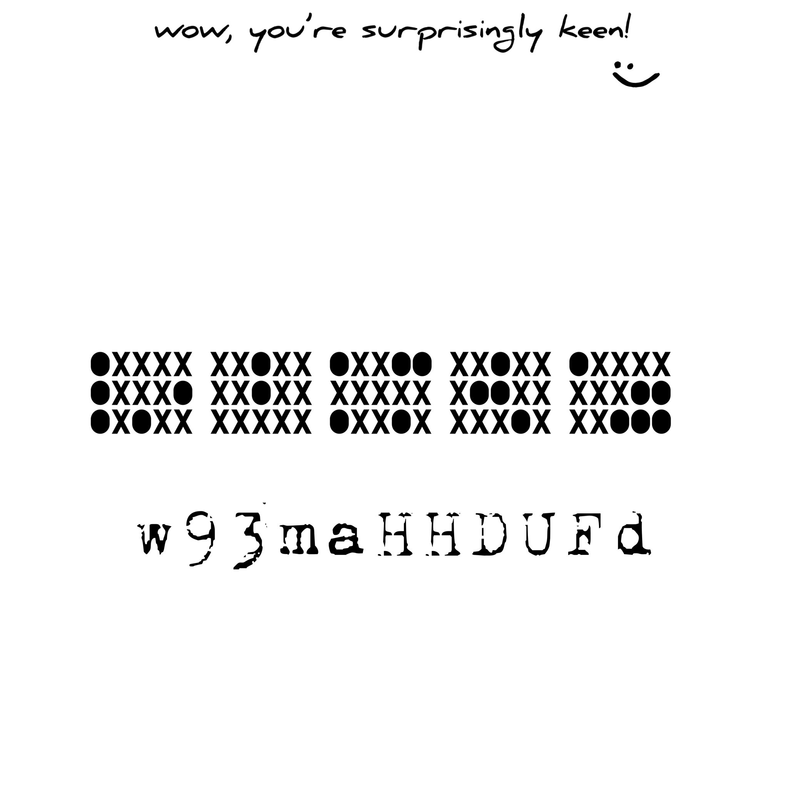
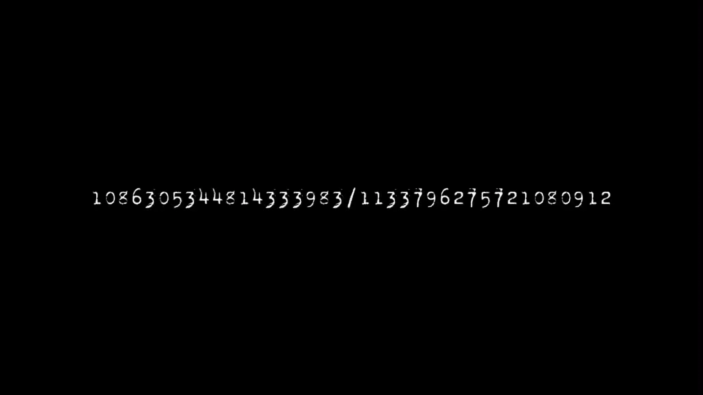
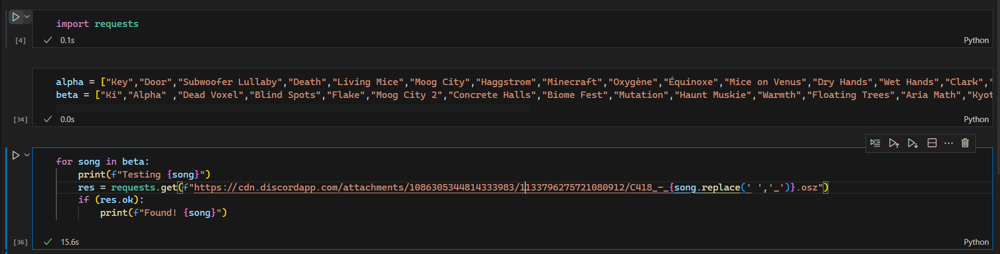
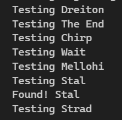

# 2023/07/27 (WYSI!): C418 - Stal

## 1. We meet again, dots and dashes

Right off the bat, we can already recognize the Morse code, which decodes to "Two dogs jumped over a rail fence", which is the key to decode the string below.

The string is encoded using Rail Fence cipher, with 2 rails ("two dogs"). After decoding, the resulting string is `829220486688800781/1133800833788686396`, which is the ID part for the [next attachment link]("https://cdn.discordapp.com/attachments/829220486688800781/1133800833788686396/photo-output.jpg").

(Extras: This is actually the 2nd version of the puzzle. The 1st one can be found [here](images/code1_alt.png). We asked -dex- about it, and he told us that it was too hard, and didn't bring extra value to the puzzle, so he removed it and revised the latter parts)

## 2. Xs and Os? Are we playing Tic-Tac-Toe?

Following the link above, you'll arrive at the 2nd puzzle

I immediately recognized the bottom text as a YouTube ID, but testing it as is didn't give me anything. We sinked a whole day trying to solve the top puzzle, which consisted of:

- Reading them as bits and read them in various ways
- Append `010` to the left and read it as ASCII
- Rotated each block to see if there's a hidden shape (the first block looks a bit sus...)

Eventually, we gave up, and asked -dex- for more clues. The first clue he gave is "i love eating pigs", which we thought as the Pigpen cipher (big mistake! wasted even more hours on that). The second clue is "especially bacon", which lead us to the correct cipher.

Decoding the block using the Bacon cipher yields "REVERSE AND WATCH", which I understood correctly as reversing the ID and go to the video.

## 3. In a blink of an eye

Following the resulting video ID ([link](https://youtu.be/dFUDHHam39w) - If -dex- takes the video down, I'll reupload it here), you're brought to what seems to be a congratulation. However, around the 54s mark, there's a few frames of another Discord attachment ID

However, we tried it with the original file name, and it didn't work. We tried a few other names which didn't lead to anything either. After this, we notified -dex- of the missing file name, and he gave us another hint. The file name is `C418_-_<Minecraft OST>.osz`.

Of course, I'm not sitting here testing every single C418 songs in Minecraft, so I used a little Python to brute force the name. And it didn't take me long

## 4. At last

The [map linked above](C418%20-%20Stal.osz) is a 2K map, with notes on the 1st column representing 0, and the 2nd column representing 1. I'll leave the rest as an exercise to the reader.

## 5. Remarks

This is significantly harder than the previous one, with many dead ends along the way, and us needing to ask for more hints from -dex-. They've definitely upped their game since the previous one, which was solved in ~1 day. This took us a total of 3 days, which definitely reflects the difficulty of the puzzles.
